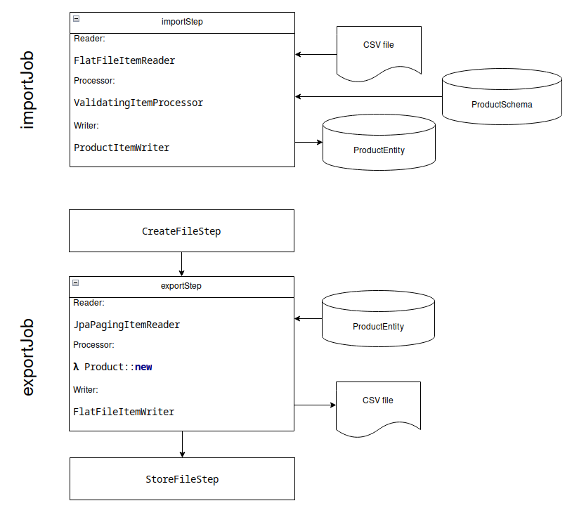

## CSV ImpEx via Native Spring Batch

In lieu of business requirements, this project has an exploratory goal: build _a_ process that can validate and import
_a_ catalogue from _a_ CSV file, export it back to a new CSV file, all async -- and then try and document a few ideas
about how these processes and the underlying catalogue could evolve with a variety of possible business requirements.

Just to have a concrete starting point (for a bite-sized catalogue with a REST API), assume: Spring Batch as the tool
and an SQL DB as the storage. With no requirements, it does not (yet) matter what the actual content of the catalogue
looks like or how it is structured, so both it and its validation can be abstracted away by using JSON with a custom
schema (or multiple custom schemas, to make it a bit more interesting).

As for the ImpEx part, \[within a simple REST API,] an async process could look like this:
1. Client initiates the process, providing input data and receiving a unique 'correlation' token in return.
2. The client uses the token to poll the process status and monitor its progress.
3. Once the status endpoint indicates that the process is finished, the client uses the token to retrieve the final
   output of the process and its statistics.

### The catalogue

The `core` of the persistent catalogue is simple: the `Product` is stored in a flat key-value storage, classified
into categories. The product's category determines which validation rules are applied to its 'value', its content.
The structure of said 'value' is unknown and irrelevant at this point, as long as the user-provided value matches
the user-provided validation schema.

The validation schema are stored in a similar fashion, the 'key' being a `Product` category, and the value being a JSON
schema matching https://json-schema.org/draft/2020-12/schema. There's a bit more to it ([versioning](archives.md)), but
that's not important right now.

The critical path:
1. Set a schema for a category.
2. Create a product with that category and content that's valid according to the schema.
3. Use the product's identifier to read it.

Simple and _sufficiently_ functional. See the module `Readme`s for API descriptions and source code for implementation
details.

### Spring Batch: forward and back

Spring Batch _works_ and has a _reasonably_ low barrier to getting the simplest jobs running, despite being a fairly
low-level library. It won't get a complex, distributed job running OOB, but (some of) the building blocks are there.

The documentation for building a job is decent, although it's primarily focused on single-run, single-job standalone
applications, instead of "traditional" microservices that declare multiple reusable jobs. Fortunately, with the late
binding tools (see `@StepScope` and `@JobScope`), assembling a job from non-threadsafe Spring beans with constructor
configuration is mostly an inconvenience. Using beans is not a hard requirement, either, a `Factory` approach _could_
work -- with the caveat that the native `JobFactory` interface cannot pass `JobParameters` to the factory method, so
each Step and component has to adapt to execution parameters dynamically[^1].

Once an instance of `Job` is obtained, running it is simple -- create an instance of `JobParameters` and pass both to
the `JobLauncher` bean. The _catch_ here is that every execution of a given job, with a given set of parameters is
_unique_, and attempting to run a "duplicate" is an instruction to restart the original execution, if possible. That's
not _exactly_ an intuitive way of working with a launcher, but it makes sense from the perspective of a stateless tool
that's designed to run exactly one job, with fixed parameters, that will be automatically restarted by an orchestrator
should it terminate. For our purposes, we can just make every parameter set unique -- we can track job executions just
fine and each is expected to have an independent lifecycle.

To run a job asynchronously OOB with the Spring Boot starter, all we need is a `TaskExecutor` bean annotated with the
`@BatchTaskExecutor` qualifier.

Once the job is running, the launcher will return a `JobExecution` object that exposes the job's state and statistics
(in excruciating detail). The execution's identifier can also be used to fetch the execution from Batch's persistence
-- which is exactly what we need for the job status and progress REST APIs, with the identifier serving as the token. 

Integrating the business logic into the steps -- readers, processors, writers for the batch impex steps, and the custom
steps for file operations -- is very straightforward. For the most part, parsing CSV can be reasonably done with Spring
Batch's boxed tools, but writing CSV requires outside help (see the implementation for details). When creating entirely
custom steps, extend `AbstractStep`. Implementing `Step` from scratch would require a fair bit of infrastructure that's
present only in the `AbstractStep` and is, effectively, required for its lifecycle to make sense during execution.

Regardless of Spring Batch's idiosyncrasies, it works -- it provides a simple, fairly configurable mechanism to run and
track async process lifecycles, with batched processing, threading support, detailed stats, and _some_ resilience. Its
'language' and tools are limited (see also: Apache Camel, Spring Integration), but it might serve as a lightweight
starting point.

[^1]: Instances of `Job` and `JobFactory` share a pool of unique names, and are strongly referenced by a registry, so
bypassing these limitations (without creating a memory leak) requires even more customization.

### One foot forward

With this "core" "functionality" "ready", we have working import and export processes (refer to code for explanation
and nuance):

It works, but there's still something we could quickly add to improve it a bit (without having to ask for new business
requirements, at least): a stateless `ValidatingItemProcessor` would be resolving the relevant schema, then parsing it
and generating a validator. Depending on the libraries and caches involved, it could have a non-trivial runtime cost!

The `JobSchemaContext` serves as a job-local cache to shift the cost from CPU and, possibly, DB to memory. The reason
it is job-local and not JVM- or cluster-wide is to just keep it simple regarding evictions, timeouts, modifications.

The 'locality' of the cache has a notable side effect: it ensures (but does not necessarily guarantee, esp. if eviction
is added) that all items in the same category will be validated by the same schema version within a single job, even if
it changes mid-run. Whether it is a relevant or helpful side effect remains to be determined by business requirements. 

### Modules to explore

See the individual pages for more information about the APIs that each module exposes.

* [`application`](application/Readme.md): This module contains the Spring Batch integration and the REST resources.
* [`core`](core/Readme.md): This module implements a simple catalogue and its validation via JSON schema.
* [`entity`](entity/Readme.md): JPA entities and repositories.

## What's next?

Naturally, this is just one simple implementation of many, and the actual goals to pursue, metrics to optimise, scale
and features to plan for can (and will) wildly vary with the business requirements. Requirements that evolve, grow in
number, contradict each other, compete in priority, and rarely concede to technical limitations. In other words, each
catalogue is either uniquely built for a specific task, or is coerced to fit the task's square hole by a multitude of
custom adapters and sacrifices.

### Business

Reporting. What would be a glaring omission, were business requirements to exist: the import job does not communicate
the messages produced by failed validations to the end user, like the REST API does. The pieces are there, but they
are not connected.

  
Implementation hint

  We already have a job that can write data from the DB to a structured file, and we can use the same approach to write
  a report, if we just put the validation errors into the DB. There are two points where an error would normally occur:
  `ProductItemValidator` and `ProductItemWriter`. Explore what Spring Batch does with those errors, and what listeners
  could be implemented to receive and persist them.

  Keep in mind that the report should at least include the identifier of the rejected product and the report must only
  contain data from a single job. If there are no other business-relevant ways to read the error persistence, consider
  removing the data after it outlived its usefulness.

  Advanced challenge: include the relevant source file's line number in the report as well.
  The domain object, `Product` does not _have_ to be the step's item type.

Audit and/or content versioning. See the [dedicated document](archives.md) for more thoughts on the matter.

### Technical

Running import jobs in parallel and/or multiple threads is a practically unavoidable step when pursuing performance.
However, doing so OOB will quickly run straight into a constraint violation for the product's unique identifier. As
mentioned in `ProductServiceImpl.java`, this is a consequence of doing parallel batched transactions (without locks,
too, but _introducing locks_ to fix this is... an adventure of its own) that all attempt to insert the same product.
There are many ways -- platform-specific[^2] and generic both -- to work around this issue or avert it outright (the
following chapter might hint at _some_ of them) 

[^2]: Including using a storage platform that doesn't actually differentiate inserts and updates like that.

## Beyond the storage

What happens next? When the catalogue is ingested, validated, and safely stored, how can it be consumed? The primary
storage is the Source of Truth, irreplaceable and ill-suited for disruptive migrations and data transformation. This
inflexibility is hardly conducive to rapidly evolving end-user business features, such as storefronts with full-text
and faceted searches, analytics, suggestion and recommendation systems -- anything that is not satisfied with a base
key-value storage.

All of that (and more) can be achieved with events: message queue, event journal, transaction log. Unordered or FIFO,
single-use or persistent, events allow any number of consumers, of any complexity, to build their own representations
of the catalogue without notable impact on the primary storage structure or runtime load. The events could be sent by
the database itself, too, like an exposed replication log, Change Data Capture, or similar internal or custom tools.

A simple example: if we add an `EventService` implementation that publishes (_just_) the product identifiers from the
events to a messaging broker (RabbitMQ, for example), we can create a new service to maintain an ElasticSearch index
just by consuming these events from the queue and fetching current product content from the primary storage.
                                                                                                            
That approach is a bit limited when it comes to re-creating a secondary storage -- as the events are neither ordered,
nor persistent, a reindex must needs rely on reading an existing primary or secondary representation of the catalogue
(in addition to continuing to consume the real-time events).

See Lambda and Kappa architectures for a more in-depth exploration of what can be achieved with a full journal / log.

## Scaling the import

The, perhaps, most glaring limitation of this implementation of import is that it is single-threaded. Obviously, it is
reading from a single, linear file, but reading requires no compute resources -- validating and persisting the content
does, and that's the costly part that usually can[^3] and should run in parallel.

Spring Batch can be configured to run a job in multiple threads, all running on a single node of the cluster. This will
help with performance, to a degree, but scaling vertically is costly and inflexible -- to do better, you need a bigger,
more expensive node (and then somehow keep it from idling too much), and it's just as fragile to node failure as single
non-clustered nodes. It's up to the developers to ensure involved Step components are actually thread-safe. For a small
catalogue with simple logic, however, it's usually quite sufficient.

For horizontal scaling, Spring Batch provides little more than a couple frameworks: partitioning and remote chunking.
The core idea is the same for both (and can be achieved without using these interfaces): instead of processing each row
as it is output by the reader, in the local JVM, write it to a queue of some kind. A message in the queue could contain
one row or a batch (with different pros and cons, but it is generally easier to work with one item per transaction), as
long as each message is handled atomically. Then, a number of consumers, local or remote, read messages from the queue,
process each one, and write a response to another queue. The queues should be persistent and guarantee delivery at least
once.

As a result, the original job only needs to queue up the initial feed and, optionally, aggregate the responses, if the
business logic demands a response for the file. The cluster of 'worker' nodes, the ones doing the arbitrarily complex
processing, can then be automatically scaled to meet the real-time demand, e.g. by monitoring the inflow queue's write
to read ratio and spinning instances up or down when the graph crosses certain thresholds.

[^3]: If there are strictly enforced relationships between different rows in the file (e.g. business logic demands that
a bundle product must be imported after all its components and import hard-fails if any do not exist), then importing a
feed requires at least some order. Grouping related products into shards, import using phases, switching to soft-linked
relations, there definitely will be options to explore. The same applies if multiple rows of the original file have the
same product with different content, and the intuitive expectation that these rows will be imported in order. 

## Concurrency: Delayed and disordered writes

If there are multiple writers independently calling the system, or unordered parallel transactions creating an illusion
of the same, then there is a risk of overwriting newer / more relevant data with older / obsolete versions. At least if
the external business logic does not explicitly provide a version for each update of the content, of course, as then it
would be just a matter of skipping out-of-order updates.

As an accessible option, a simple timestamp can be used as a version. For REST requests, it would be the update request
timestamp, for an import job -- the timestamp of the original request that initiated it, regardless of when the job ran
or the actual time when the job queued or executed the update of the specific product. Naturally, collisions can and do
happen, but in practice millisecond precision is more than sufficient -- after all, if two requests update the same row
at (effectively) exactly the same time, then there is no definitively correct outcome, both are equally valid.

Products with multiple independently-updated parts (e.g. content + price data + translation per language) would require
separate versioning for each atomic part. A 'composite' feed or endpoint would separately check and update each version.

Another (far more costly and complex, if such a broker is not already in use) option, would be to use partially ordered
or FIFO messaging, like Kafka or AWS FIFO SQS, as the sole source for _all_ product updates, a single writer regardless
of the update's entry point. This approach does not prevent the 'exactly the same time' conflict, but it does introduce
order earlier, so re-reading the events from the journal multiple times will always have the same outcome.

The latter approach also simplifies incremental updates, where a small delta is merged into the current content instead
of an atomic overwrite. Applying the deltas in strict order requires considerably less metadata to maintain integrity. 

## Running the application

Application preconfigured to use JDK 17 and PostgreSQL 16.

Set the property `spring.dataSource.url` to point to a running PostgreSQL instance, and `spring.dataSource.username` +
`spring.dataSource.password` to the corresponding credentials. The DB schema will be initialized automatically.

The default port for the web API is `8080`.
