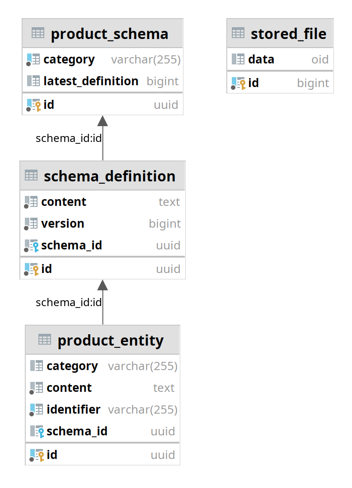

# `entity`: The Persistence Module

A basic implementation of the simplest possible product catalogue.

## Entities:

### ProductEntity
This key-value storage holds the actually 'business-relevant' product data of the catalogue.

#### Columns:
* `id`: the synthetic primary key; not directly used in any relations at this time and may be omitted in favour of the natural key
* `identifier`: the natural key, unique product identifier and the 'key' of the key-value storage; maximum column length should be
   configured according to business requirements and explicitly enforced during validation
* `content`: the 'value' of the key-value storage; generally, this column greatly benefits from unlimited length, if the DB allows
  it. If a limited-width type is used, validation must be extended to include the appropriate length check.
* `category`: product class or type that determines which validation schema is used to validate this product's content; if used to
  filter products, consider adding an index.
* `schema`: a direct reference to the exact revision of the validation schema that was used to validate this exact version of this
  product's content. This column could be useful for reporting, and filtering or migrating outdated content. 
  
### SchemaDefinition
This immutable, insert-only entity is used to store a specific revision of a validation schema for a specific category.

#### Columns:
* `id`: the synthetic primary key
* `schema`: reference to the parent `ProductSchema` object
* `version`: the entities' numerical order within a single `ProductSchema` object
* `content`: the actual validation schema; see `Product` `content` above regarding column length

### ProductSchema
A multi-value collection of `SchemaDefinitions` for a single product category.

#### Columns:
* `id`: the synthetic primary key
* `category`: the natural key, product category / class / type
* `latestDefinition`: the value of the `version` column of the most current `SchemaDefinition`
#### Child entities 
* `definitions`: the collection of related `SchemaDefinitions`, formed by references in their `schema` columns

### StoredFile
Storage for a placeholder implementation of cluster-wide file repository.  

#### Columns:
* `id`: primary key, a reference to a Spring Batch job execution that created the file
* `data`: BLOB containing the file

## Notes:
The module does not include any SQL migration libraries, SQL scripts, custom names or sizes for objects, or ORM-specific
annotations. Several column descriptors refer to `text`, a PostgreSQL column type for Strings, with (practically)
unlimited size.

Additional columns can be added as necessary, like creation/modification dates, references to the users making those
changes, relationships, other metadata or search-assisting index columns.

On a related note, product relationships, however tempting the strict integrity checks may seem, generally should not be
modeled using foreign keys. Unless business requirements directly contradict this, late-linked[^1] relationships are
essential to maximizing ingest flexibility, allowing products to be ingested in any order (or in parallel), atomically,
and with entirely deterministic results.

[^1]: Late-linked (soft-linked) relationships use natural keys to reference other entities, with no constraint checks
at ingest time. The natural keys are only resolved into concrete entities later, when the relation is consumed by the
business logic. If, at that time, the referenced product doesn't exist, then the reference (or the entire entity that
holds it) can be declared invalid or ignored.
